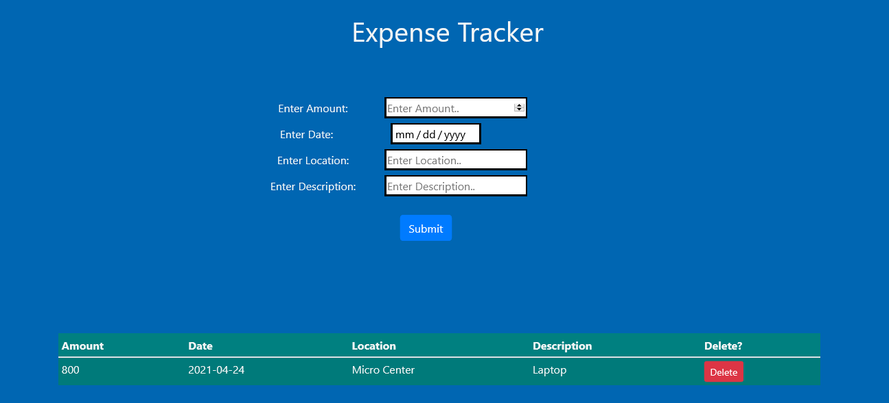

# React  Expense Tracker

An Expense tracker using React, HTML, CSS, JavaScript, and Bootstrap.

### Try it out [here](https://improved-expense-tracker.herokuapp.com/)

## Summary 

Created another expense tracker, but utilizing React this time around. The intent to recreate this application was to introduce me to the React framework. After building this application I got a better understanding how powerful React can be especially with the addition of Bootstrap. Looking back I am definitely excited to dive deeper into React and other frameworks as well. 

## Author

Dante Leeseberg - Full Stack Software Developer [LinkedIn](https://www.linkedin.com/in/dante-leeseberg-bba05883/)
| Website coming soon. 

